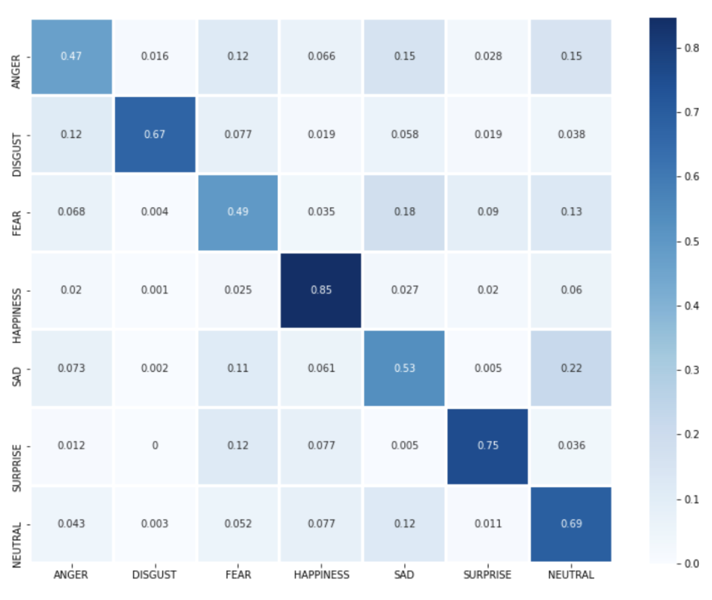

# Reko Model

Facial emotion recognition using convolutional neural network (made with TensorFlow).

Emotions which model can recognize:

- Anger
- Disgust
- Fear
- Happiness
- Sadness
- Surprise
- Neutral

I took the core model from [gitshanks repository.](https://github.com/gitshanks/fer2013)

Model accuracy:

## Stack

- Jupyter Notebook
- TensorFlow
- sklearn
- matplotlib
- seaborn
- cv2

## Mobile application

I used the model in [my Android application](https://github.com/weazyexe/reko-app), check it out :)
